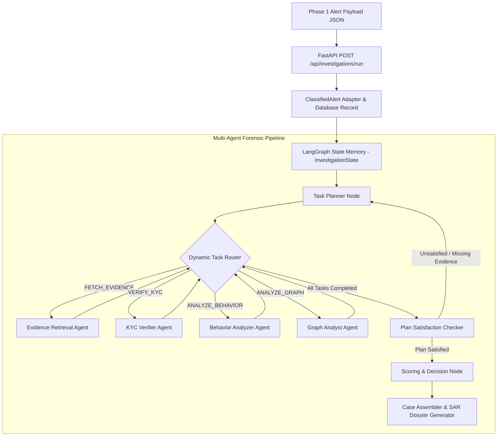

# 🔍 FinSpectra — Multi-Agent Financial Crime Investigation Engine

[](https://www.python.org/)
[](https://fastapi.tiangolo.com/)
[](https://www.langchain.com/langgraph)
[](https://groq.com/)

**FinSpectra** is an autonomous, task-driven **Multi-Agent Anti-Money Laundering (AML) & Financial Crime Investigation Engine**. Built on **FastAPI**, **LangGraph**, **SQLAlchemy**, and **Groq LLM**, it bridges early-stage alert triage (Phase 1) with deep forensic multi-agent evidence gathering and automated Suspicious Activity Report (SAR) dossier generation (Phase 2).

---

## 🌟 Key Features

- 🌉 **Phase-1 REST API Bridge**: Accepts incoming raw JSON alert payloads from legacy triage engines and normalizes them into structured investigation state via a flexible Pydantic adapter (`ClassifiedAlert`).
- 🤖 **Task-Driven LangGraph Engine**: Dynamically plans, queues, routes, and validates multi-agent forensic tasks based on detected money laundering typologies (`STRUCTURING`, `FAN_IN`, `FAN_OUT`, `RAPID_PASS_THROUGH`).
- 🕵️‍♂️ **Specialized Evidence Agents**:
  - **Evidence Retrieval Agent**: Queries transaction history, account records, and prior case memories.
  - **KYC Verifier Agent**: Cross-references customer profiles and occupations against transaction volume.
  - **Behavior Analyzer Agent**: Calculates statistical velocity Z-scores, volume surges, and pass-through ratios.
  - **Graph Analyst Agent**: Analyzes 2-hop topological network structures for hub nodes, circular flows, and shell intermediaries.
- 🎯 **Plan Satisfaction Checker**: Validates task completion and evidence integrity before routing to scoring; automatically retries incomplete plans.
- ⚖️ **Risk Scoring & Decision Engine**: Combines rule-based risk scoring with LLM-backed reasoning to assign actionable outcomes: `ALLOW`, `REVIEW`, or `BLOCK`.
- 📝 **Automated SAR Dossier Generation**: Generates comprehensive narrative summaries suitable for regulatory filing.
- ⚡ **Offline Mock Fallback**: Seamlessly runs with full offline capability when Groq API keys are absent.

---

## 🏗️ Architecture & Workflow



---

## 📂 Repository Structure

```
finspectra/
└── backend/
    ├── app/
    │   ├── agents/
    │   │   ├── nodes/               # Specialized Forensic Agent Nodes
    │   │   │   ├── alert_normalizer.py
    │   │   │   ├── behavior_analyzer.py
    │   │   │   ├── case_assembler.py
    │   │   │   ├── evidence_retrieval.py
    │   │   │   ├── graph_analyst.py
    │   │   │   ├── investigation_planner.py
    │   │   │   ├── kyc_verifier.py
    │   │   │   ├── plan_checker.py
    │   │   │   ├── scoring_node.py
    │   │   │   ├── task_planner.py
    │   │   │   └── typology_classifier.py
    │   │   ├── graph.py             # LangGraph Workflow & Dynamic Routing
    │   │   ├── llm_client.py        # Groq API Client with Offline Mock Fallback
    │   │   └── state.py             # LangGraph Shared TypedDict Memory
    │   ├── api/
    │   │   └── routes_investigations.py  # REST API Controllers
    │   ├── models/
    │   │   └── schema.py            # SQLAlchemy DB Models & Pydantic Schemas
    │   ├── config.py                # Environment Configuration
    │   ├── database.py              # SQLite Database Session & Connection
    │   └── main.py                  # FastAPI Application Entrypoint
    ├── demo_test.py                 # Standalone Terminal Workflow Demo
    ├── test_phase1_bridge.py        # Phase-1 API Payload Integration Test
    ├── .env.example                 # Template Environment Configuration
    └── requirements.txt             # Python Dependencies
```

---

## 🚀 Getting Started

### Prerequisites

- **Python 3.10+** installed
- **Git** installed

### 1. Clone & Set Up Directory

```bash
git clone https://github.com/vulcansmith-dev/Fin-Spectra.git
cd Fin-Spectra/backend
```

### 2. Virtual Environment Setup

```bash
# Create virtual environment
python3 -m venv venv

# Activate virtual environment
source venv/bin/activate

# Install dependencies
pip install -r requirements.txt
```

### 3. Environment Configuration

Copy the sample `.env.example` file to `.env`:

```bash
cp .env.example .env
```

Configurable options in `.env`:
```env
# Groq LLM API Key (https://console.groq.com/keys)
GROQ_API_KEY="gsk_your_groq_api_key"

# Model Choice
GROQ_MODEL="llama-3.3-70b-versatile"

# Mock Mode (Set to true for offline testing without Groq)
MOCK_LLM_MODE="false"

# Database Connection
DATABASE_URL="sqlite:///./nova.db"

# Server Settings
PORT=8000
```

---

## 💻 Running the Application

### Start the FastAPI Backend Server

```bash
source venv/bin/activate
uvicorn app.main:app --host 0.0.0.0 --port 8000 --reload
```

Server will run at: **`http://localhost:8000`**

### Interactive API Documentation

Once the server is running, open your browser:
- **Swagger Interactive UI**: `http://localhost:8000/docs`
- **ReDoc UI**: `http://localhost:8000/redoc`

---

## 📡 API Reference

### 1. Run Multi-Agent Investigation
- **Endpoint**: `POST /api/investigations/run`
- **Request Body**:
```json
{
  "classified_alert_id": "ALT-PHASE1-0042",
  "account_id": "ACC-9942",
  "alert_type": "STRUCTURING",
  "triggered_rules": ["STRUCTURING", "HIGH_VELOCITY"],
  "detected_reason": "Multiple structured deposits under $10,000 threshold within 1 hour",
  "evidence": {
    "total_amount": 29400.0,
    "transaction_count": 3,
    "avg_amount": 9800.0
  },
  "risk_score": 88.0,
  "risk_level": "CRITICAL"
}
```

### 2. List Historical Cases
- **Endpoint**: `GET /api/investigations/cases`

### 3. Get Case State Snapshot
- **Endpoint**: `GET /api/investigations/cases/{case_id}`

### 4. Health Check
- **Endpoint**: `GET /api/health`

---

## 🧪 Testing & Demonstrations

### 1. Phase-1 REST Payload Integration Test
Verifies end-to-end compatibility between Phase-1 JSON structures and Phase-2 state initialization:
```bash
python test_phase1_bridge.py
```

### 2. Standalone Multi-Agent Workflow Demo
Simulates full multi-agent task execution, evidence accumulation, and plan satisfaction checking in terminal:
```bash
python demo_test.py
```

---

## 🛡️ License

Distributed under the MIT License. See `LICENSE` for more information.
